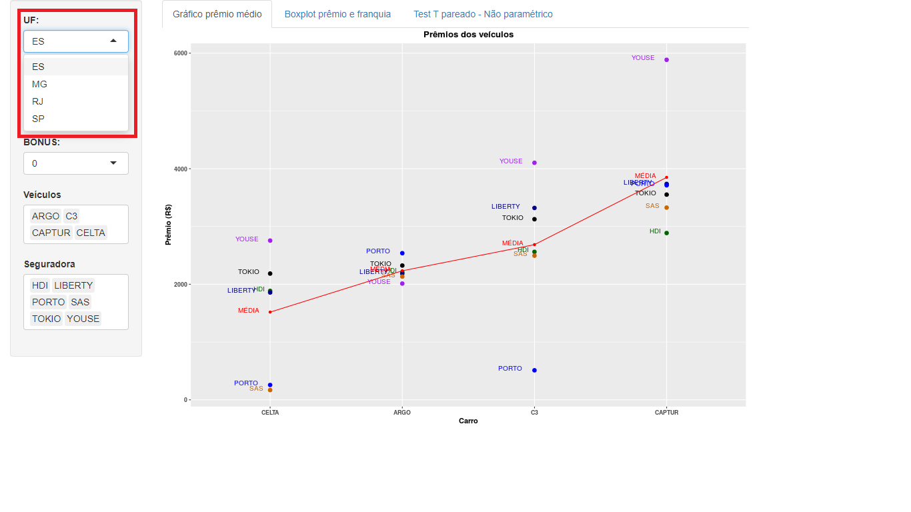
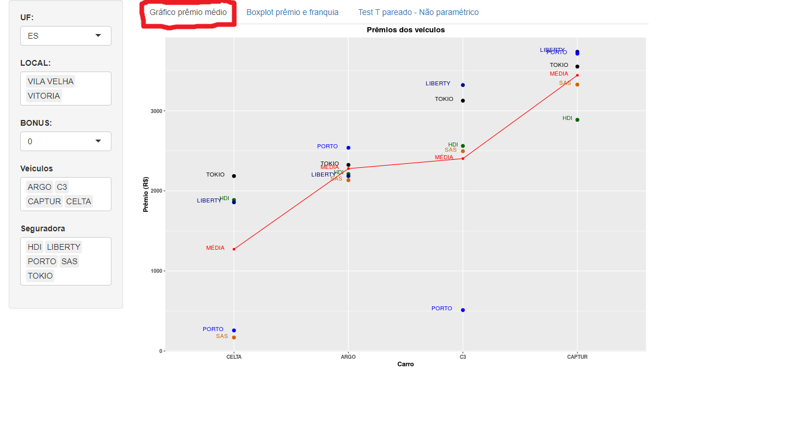
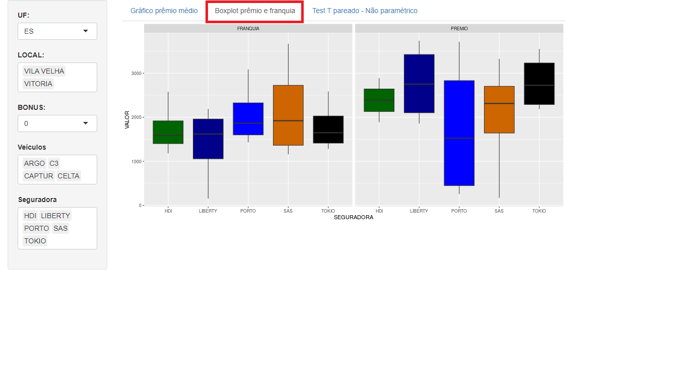
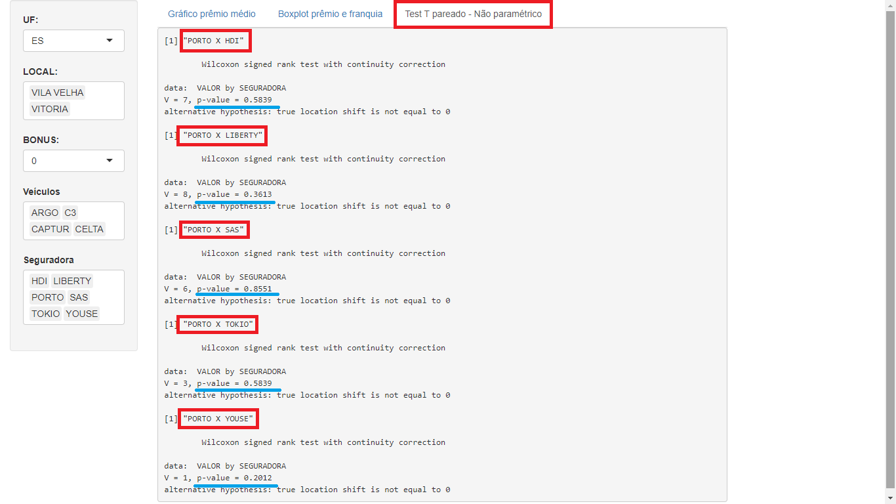

# Insurance_Market_Price

Esse é o link do simulador criado por mim (@fabricio.giordanelli) :

https://fabriciogiordanelli.shinyapps.io/Insurance_Market_Price/

Nesse estudo criei um simulador do preço de prêmio de cinco seguradora : Porto Seguros, Youse, HDI, SulAmérica e Liberty.

<p float="left">
  
  
  
</p>

Na tela inicial, podemos ver as opções. Nas opções temos a UF, o local da UF, o tipo do bônus do automóvel, os veículos disponíveis e as seguradoras.



Na mesma tela, podemos ver um gráfico que mostra as seguradoras, os veículos, os valores dos prêmios e a média por veículo.

Esse é um gráfico muito útil no dia a dia.


```{r }

ggplot() +
            # aqui é o ponto das seguradoras
            geom_point(data = dados1(), aes(x=reorder(VEICULO, VALOR), y=VALOR, color = SEGURADORA, group = SEGURADORA), size = 2.5) +
            #aqui é o texto das seguradoras 
            geom_text(data= dados1(), aes(x=reorder(VEICULO, VALOR), y=VALOR, color = SEGURADORA, group = SEGURADORA, label = SEGURADORA), hjust=1.5, vjust=0.1, size=3.5) +
            # aqui é o ponto da média
            geom_point(data = dados1_media(), aes(x=reorder(VEICULO, MEDIA), y=MEDIA), colour = "red") +
            # aqui é a linha da média
            geom_line(data = dados1_media(), aes(x=reorder(VEICULO, MEDIA), y=MEDIA), colour = "red", group = 1) +
            # aqui é o texto da média
            geom_text(data= dados1_media(), aes(x=reorder(VEICULO, MEDIA), y=MEDIA, label = MEDIA2), hjust=1.5, vjust=0.1, size=3.5, colour = "red") +
            # detalhe 1
            scale_linetype_manual(values = cols1) +
            #detalhe 2
            scale_color_manual(values=cols2) +
            # detalhe 3
            theme(plot.title = element_text(hjust = 0.5, face="bold")) +
            # detalhe 4
            theme(axis.title.x = element_text(face="bold"), axis.text.x = element_text(face="bold")) +
            # detalhe 5
            theme(axis.title.y = element_text(face="bold"), axis.text.y = element_text(face="bold")) +
            # detalhe 6
            theme(text = element_text(size=11))+ theme(legend.position='none') +
            # detalhe 7
            labs(title = "Prêmios dos veículos",
                 x = "Carro",
                 y = "Prêmio (R$)")

```




Na segunda aba, temos o boxplot tanto do prêmio como da franquia. É muito comum como estratégia do mercado alguma seguradora colocar o preço muito alto para que não venda seguro em certa região. Adotando essa estratégia, podemos ver que o boxplot fica bastante alterado.



E, na última aba, fazemos um teste estatístico comparando a segurado da porto seguro com cada uma das outras seguradoras em relação ao preço do seguro para saber se há diferença entre eles. Se o p-valor for menos que 0.05, é um grande indicativo que há diferença. Nesse exemplo, não há diferença significativa.




